

<!-- TOP BANNER -->

  <strong>⚠️ A bird's nest does not always mean a machine problem.</strong>
  Improper cap installation, hooping, stabilizer selection, or digitizing can also cause thread nesting.

<h2>Select Your Embroidery Scenario</h2>

👇 Click the image below to see the step‑by‑step guide.

<!-- CARDS（已移除 onclick，绑定交由下方脚本处理） -->

  

    

      

        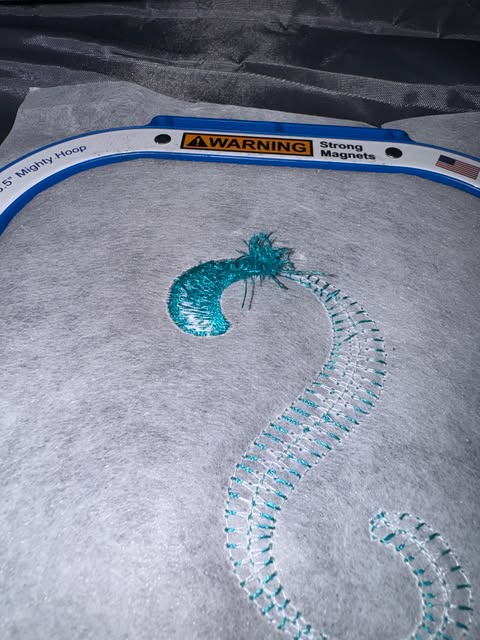
      

      
👕 Clothing — Bird's Nest

    

  

  

    

      

        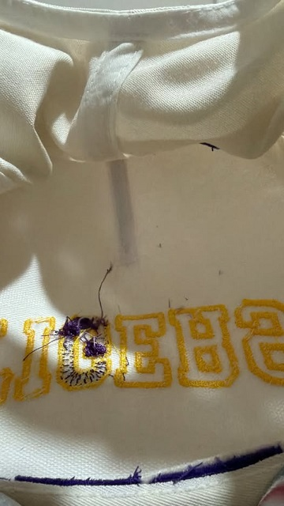
      

      
🧢 Caps — Bird's Nest

    

  

<!-- DETAIL A: CLOTHING -->

  <h4>🧵 Clothing — Troubleshooting</h4>
  
<strong>Applies to:</strong> T‑shirts, shirts, sweatshirts, denim, and other garments.

  

    

      ⚙️ Machine Setup▾
    

    

      <h5>Threading, Tension &amp; Needle</h5>
      

        

          
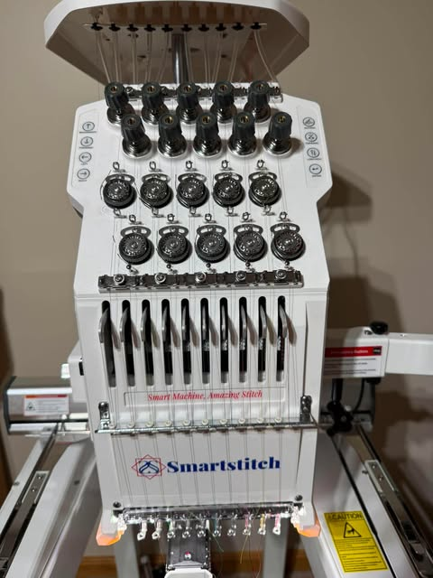

          
1Verify threading path

        

        

          
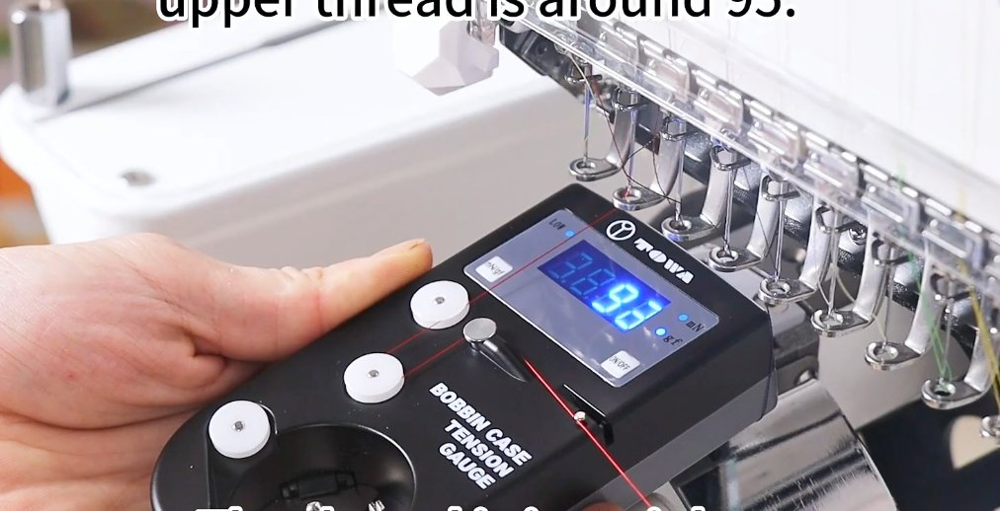

          
2Check top tension

        

        

          
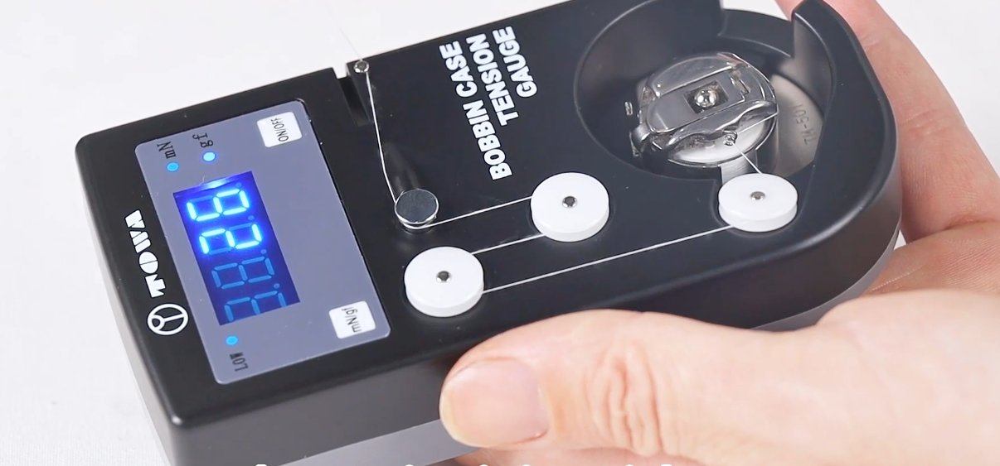

          
3Check bobbin tension

        

        

          
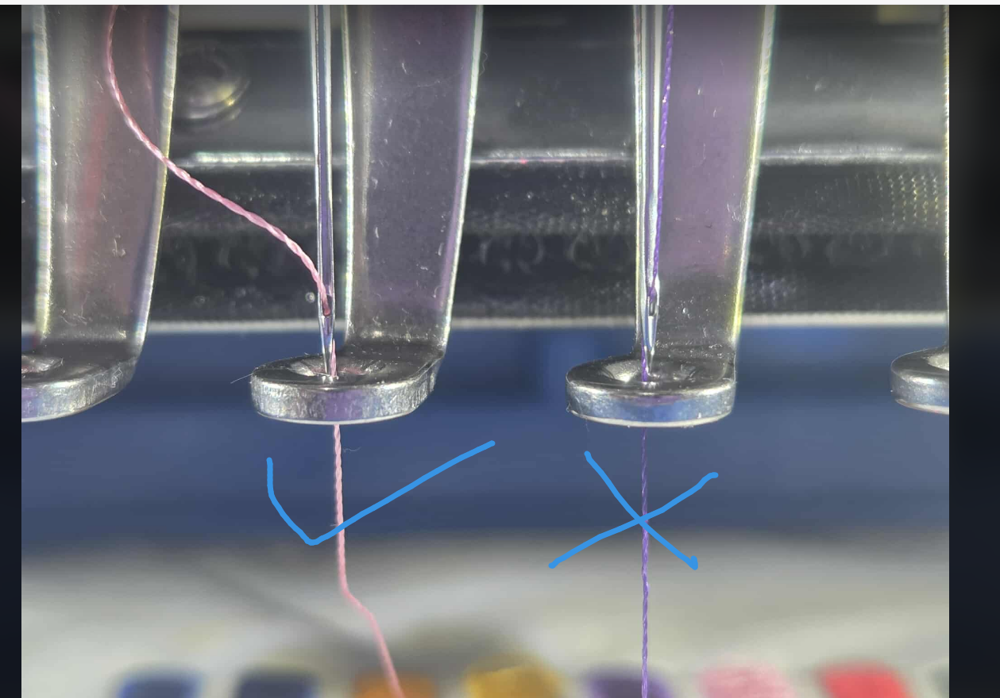

          
4Needle direction &amp; insertion

        

        

          
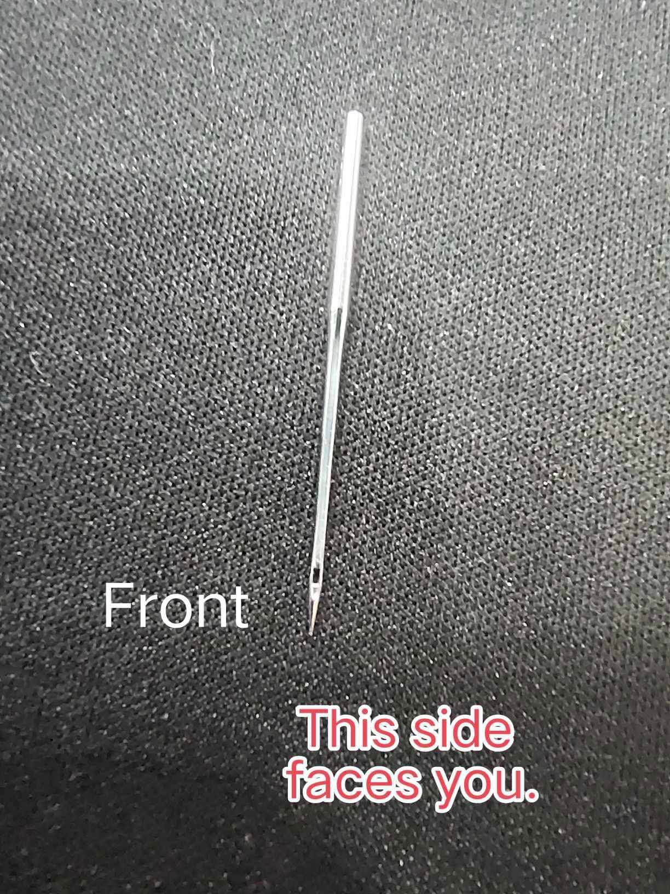

          
5Replace if bent/damaged

        

      

    

  

  

    

      📦 Material Setup▾
    

    

      <h5>Hooping &amp; Stabilizer</h5>
      

        

          
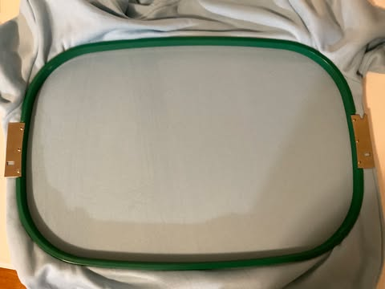

          
1Hoop taut — no wrinkles

        

        

          
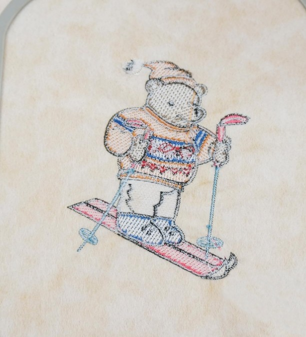

          
2Correct stabilizer type

        

        

          
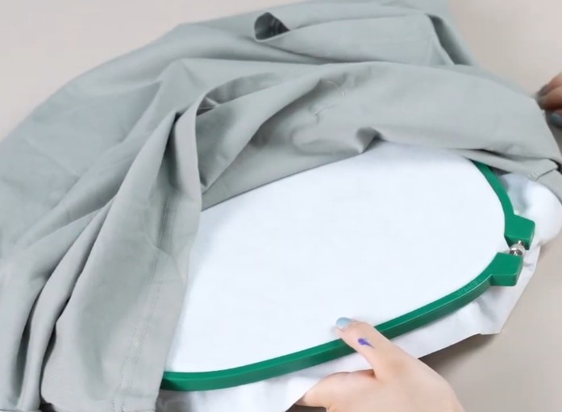

          
3Stabilizer covers full hoop

        

        

          
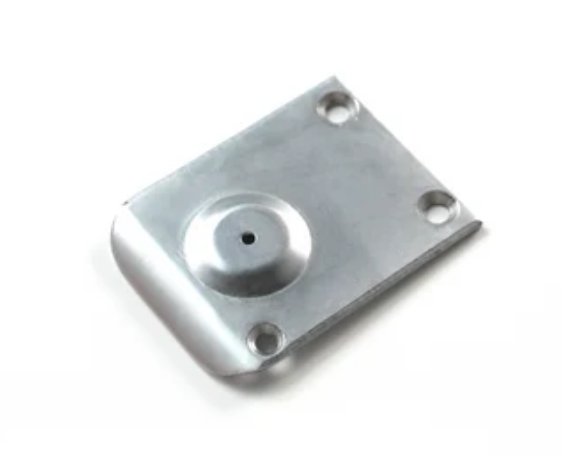

          
4Needle plate — no burrs/lint

        

      

    

  

  

    

      💻 Digitizing▾
    

    

      <h5>Design‑related causes</h5>
      

        

          

          
1Density(Replace it with the standard tension test design.)

        

        

          

          
2Incorrect underlay

        

        

          
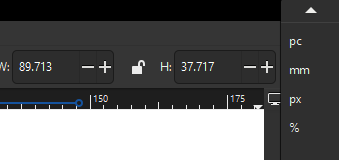

          
3Scale the design up or down to the correct size.

        

       

    

  

  

    

      🔧 Hardware &amp; Timing▾
    

    

      <h5>Bobbin Case, Rotary Hook &amp; Timing</h5>
      

        

          
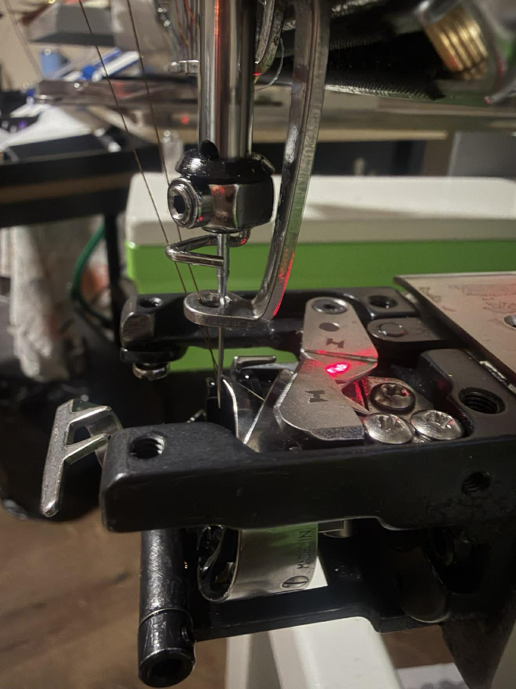

          
1Inspect bobbin case

        

        

          
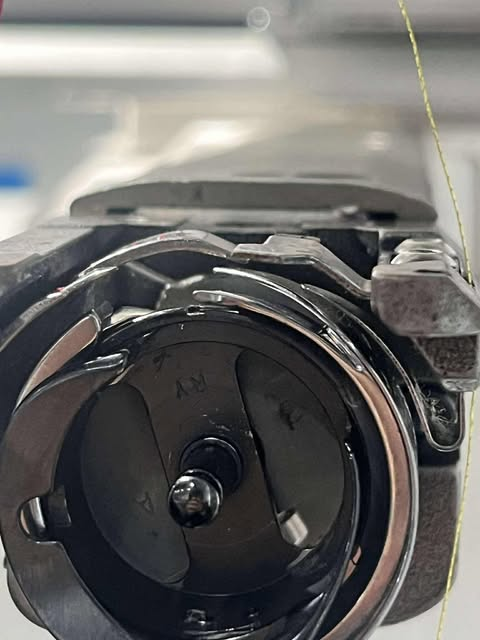

          
2Clean rotary hook area

        

        

          

          
3Timing at 202° — last resort

        
          
      

    

  

  

    <strong>✅ Verification:</strong> Run a test on the same fabric. If the bird's nest disappears, the issue is resolved.
  

<!-- DETAIL B: CAPS -->

  <h4>🧢 Caps — Troubleshooting</h4>
  
<strong>Applies to:</strong> Baseball caps, bucket hats, military caps, and other structured headwear.

  

    

      🧢 ⭐ Cap Installation▾
    

    

      <h5>#1 cause — secure the cap properly</h5>
      

        

          

          
1Seated on cap driver

        

        

          
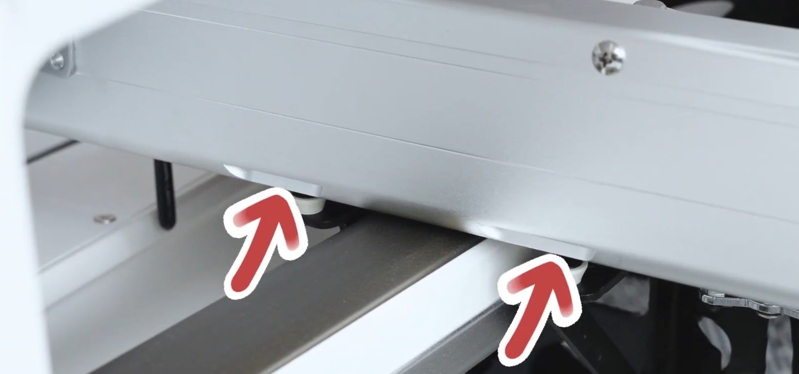

          
2Frame installed securely

        

        

          
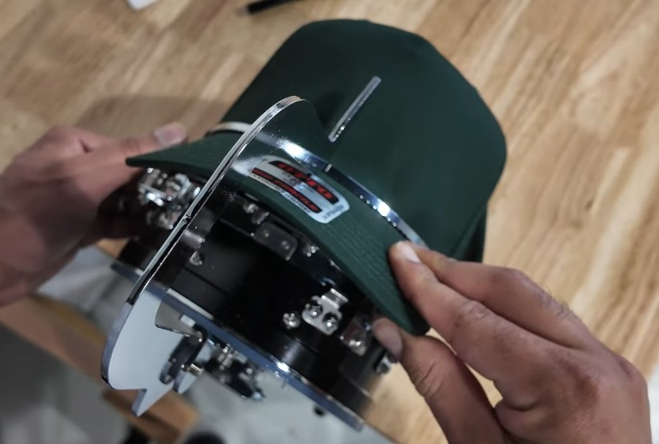

          
3Cap centered under needle

        

        

          
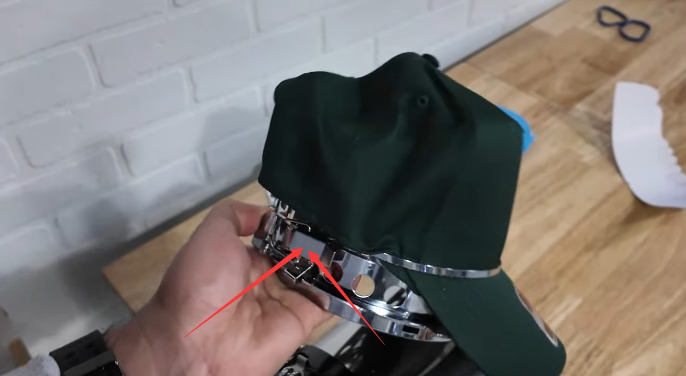

          
4Firmly clamped — no movement

        

        

          
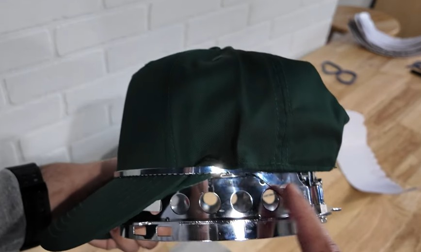

          
5Brim positioned correctly

        

      

    

  

  

    

      ⚙️ Machine Setup▾
    

    

      <h5>Threading, Tension &amp; Needle</h5>
      

        

          

          
1Verify threading path

        

        

          

          
2Top tension — slightly tighter

        

        

          

          
3Bobbin — slightly looser

        

        

          
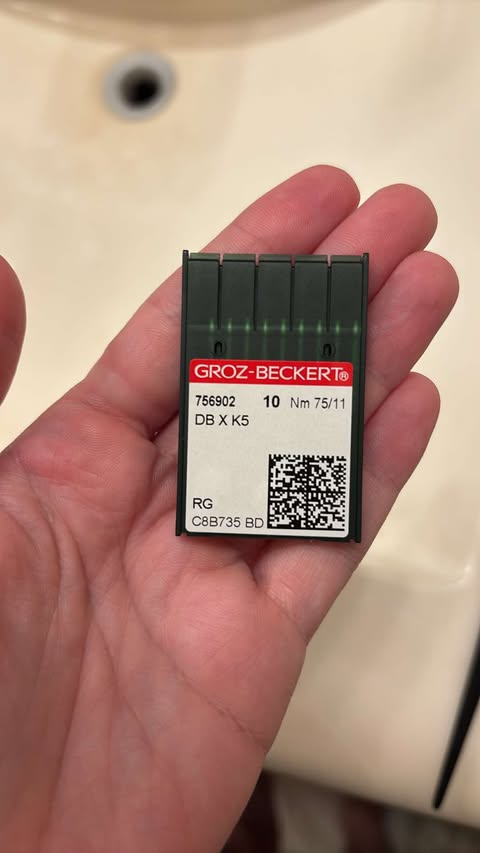

          
4Correct needle size

        

      

    

  

  

    

      💻 Digitizing▾
    

    

      <h5>Design‑related causes for caps</h5>
      

        

          
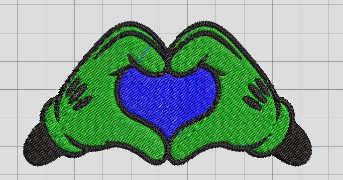

          
1Density too high

        

        

          
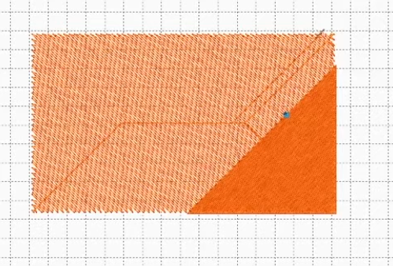

          
2Incorrect underlay

        

        

          
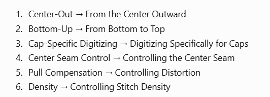

          
3Hat embroidery should stitch from the center outward to both sides.

        

      

    

  

  

    

      🔧 Hardware &amp; Timing▾
    

    

      <h5>Bobbin Case, Rotary Hook &amp; Timing</h5>
      

        

          

          
1Inspect bobbin case

        

        

          

          
2Clean rotary hook area

        

        

          
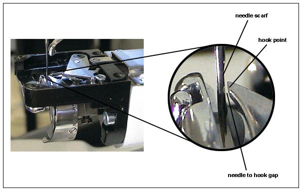

          
3Timing at 202° — last resort

        
       
      

    

  

  

    <strong>✅ Verification:</strong> Run a test on the same cap. If the bird's nest disappears, the issue is resolved.
  

<!-- JAVASCRIPT：统一事件绑定，不依赖任何内联 onclick -->

<h2>Quick Summary</h2>

  

    <h5>👕 Clothing — Check Order</h5>
    <ol>
      <li>Machine Setup (threading, tension, needle)</li>
      <li>Material Setup (hooping, stabilizer)</li>
      <li>Digitizing (density, underlay, pull comp)</li>
      <li>Hardware (bobbin case, hook, timing)</li>
    </ol>
  

  

    <h5>🧢 Caps — Check Order</h5>
    <ol>
      <li><strong>Cap Installation (most critical!)</strong></li>
      <li>Machine Setup (threading, tension, needle)</li>
      <li>Digitizing (density, underlay, stitch direction)</li>
      <li>Hardware (bobbin case, hook, timing)</li>
    </ol>
  

