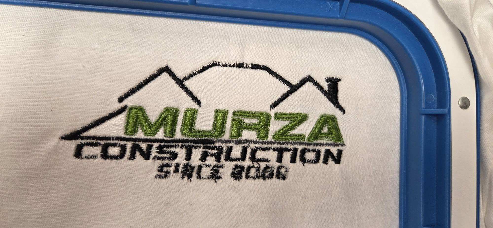

# How to Fix Bobbin Thread Showing on Top of Embroidery

The upper thread tension is too tight compared to the bobbin tension, which is why the bobbin thread is being pulled to the top. Please reduce the upper thread tension or increase the bobbin tension to balance them.

When the bobbin thread appears on the top side of an embroidery design, it usually means the thread tension balance is incorrect.

In a properly balanced embroidery stitch, the bobbin thread should remain hidden on the back side of the design, while the upper thread should cover the visible embroidery area.

## Symptoms

You may notice:

- White or bobbin-colored thread appearing on the top of the design.
- Small dots or lines of bobbin thread visible in the embroidery.
- Poor stitch appearance even though the design is aligned correctly.
- The upper thread does not fully cover the embroidery area.

## Common Causes

The most common causes include:

- Upper thread tension is too tight.
- Bobbin tension is too loose.
- Incorrect bobbin installation.
- Wrong needle size or damaged needle.
- Incorrect thread type or thread weight.
- Poor stabilization of the fabric.
- Design density or digitizing issues.

## Step 1 — Check Upper Thread Tension

If the upper thread tension is too tight, it can pull the bobbin thread to the front.

Check:

- Reduce the upper thread tension gradually.
- Run a test embroidery.
- Compare the front and back sides of the design.

Avoid making large tension adjustments at once.

## Step 2 — Check Bobbin Installation and Tension

Remove the bobbin case and check:

- The bobbin is installed in the correct direction.
- The bobbin thread passes correctly through the tension spring.
- The bobbin case is clean and free of lint.

If the bobbin tension is too loose, the bobbin thread may be pulled to the top.

## Step 3 — Check Needle and Thread Selection

Incorrect needle or thread combinations can affect stitch balance.

Check:

- Use the correct needle size for the thread.
- Replace bent or damaged needles.
- Confirm the thread is suitable for embroidery.

## Step 4 — Check Stabilizer and Fabric Support

Insufficient stabilization can cause the fabric to move and affect thread tension.

Make sure:

- The correct stabilizer is used.
- The fabric is firmly hooped.
- The material does not move during embroidery.

## Step 5 — Check Design Settings

Some designs may naturally require adjustment.

Check:

- Stitch density.
- Underlay settings.
- Pull compensation.
- Small lettering settings.

A poorly digitized design can also cause tension imbalance.

## Test After Adjustment

After making adjustments:

1. Run a small test design.
2. Check the front and back sides.
3. Confirm the bobbin thread is mostly visible only on the back.
4. Continue adjusting until the stitch balance is correct.

## Preventive Maintenance

To reduce the chance of bobbin thread showing on top:

- Clean the bobbin case regularly.
- Check thread tension before large projects.
- Use the correct needle and thread combination.
- Replace worn needles.
- Maintain proper stabilization.

## Need More Help?

If the problem continues, record a short video showing:

- The front side of the embroidery.
- The back side of the embroidery.
- The bobbin case and bobbin installation.
- Current tension settings.

This information will help diagnose the problem more accurately.
