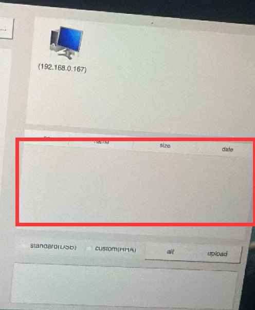
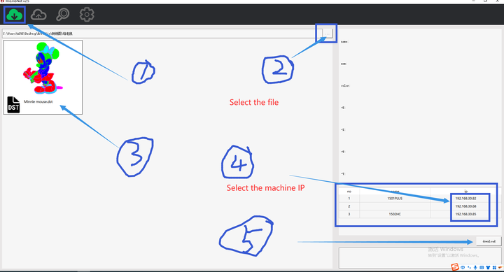
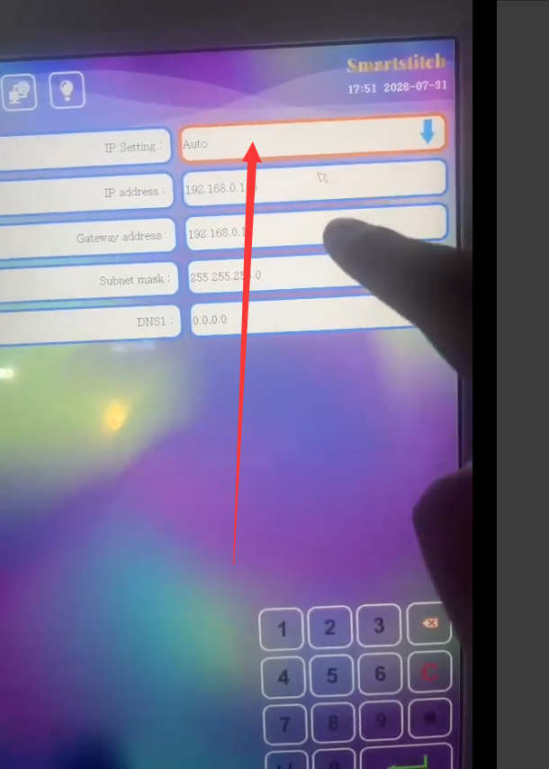

# Computer Cannot Detect the SmartStitch Machine — Check Settings

One of the most frustrating issues in digital embroidery is when your computer simply does not recognise the SmartStitch machine. This prevents design transfer, parameter adjustments, and real‑time monitoring.

Most detection failures are **not hardware‑related** – they originate from incorrect settings, driver conflicts, or cable/port issues. Follow this structured troubleshooting process to quickly isolate and fix the problem.

## Normal operating procedure

---

## Common Root Causes

- Firewall or antivirus blocking the communication port
- Multiple software instances accessing the same port
- IP Address Conflict Between the Computer and the Machine

---

## Step‑by‑Step Diagnostic Process

Perform these checks in the recommended order – from the simplest to the most advanced.

### Step 1: Verify Power and Machine Status
### Step 2: Restart and Re‑detect
- Restart both the machine and the computer.
- Unplug the cable, wait 10 seconds, then plug it back in while the software is open.
- Watch for the system tray notification that a new device is connected.

### Step 3: Please check the machine’s IP settings and confirm whether it is set to obtain an IP address automatically  (AUTO)

---

## Video Tutorial

Watch the full walkthrough below .



*(Replace `YOUR_VIDEO_ID` with the actual YouTube ID of your chosen video.)

---

> **Tip**:If it still doesn’t work, please contact the SmartStitch support team for further assistance.