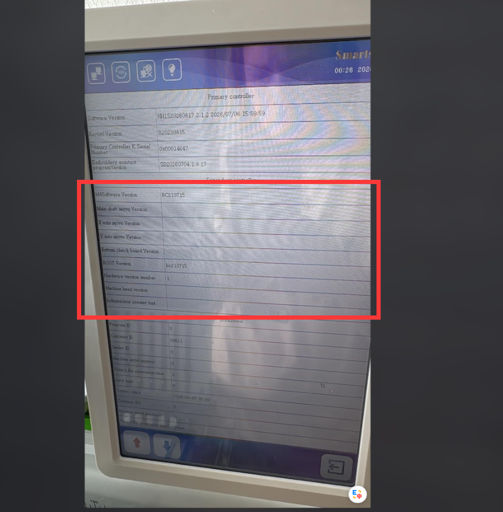
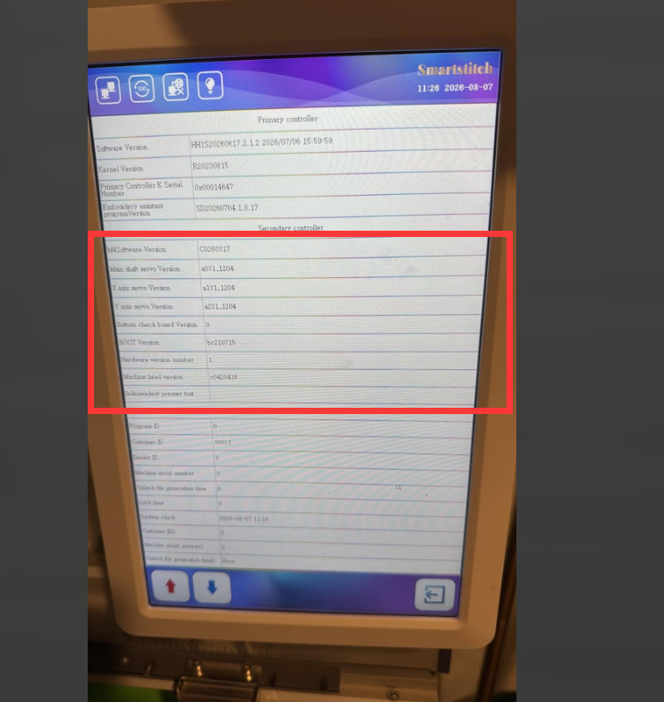



CAN1 Send Message Queue Full Error



# Please shut down the machine and restart it. You can also leave it powered off overnight and try again the next day.

## Please check the system version

 

### This is the wrong version. The machine cannot recognize the version information.❌️

### This is the correct version. The machine can recognize the version information.✅️

